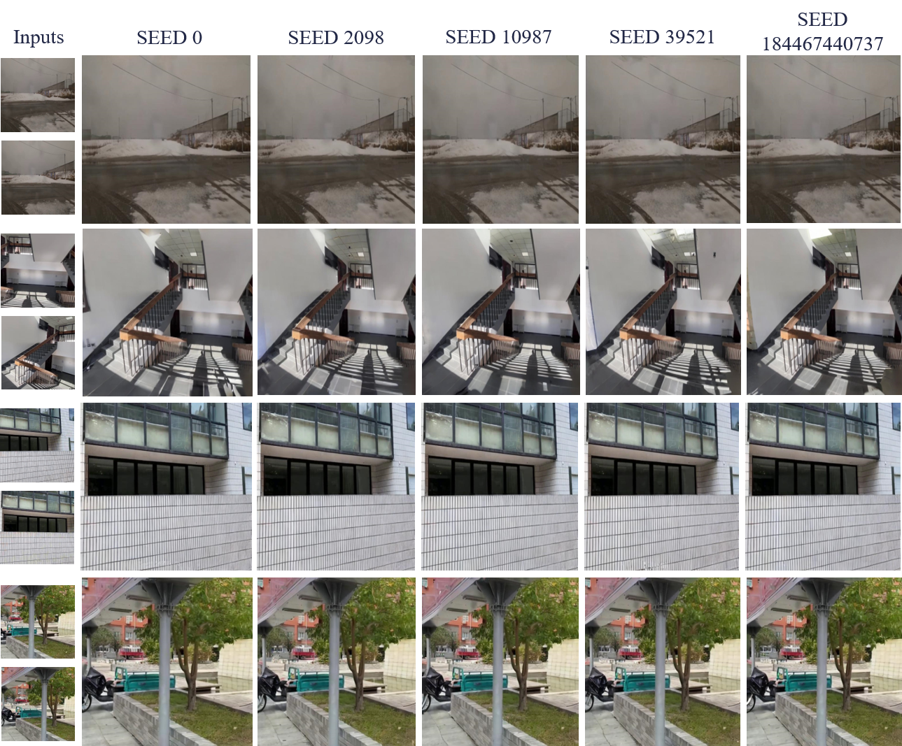

# Reconstructing the Image Stitching Pipeline: Integrating Fusion and Rectangling into a Unified Inpainting Model

### [Paper](https://arxiv.org/abs/2404.14951)

## Requirements
- Python >= 3.9
- GPU (NVIDIA CUDA compatible)
  
- Create a virtual environment (optional but recommended):

    ```bash
    conda create -n srstitcher python==3.9
    conda activate srstitcher
    ```
    
- Install the required dependencies:

    ```bash
    pip install -r requirements.txt
    ```
  
 **Notice: check `transformers==4.35.2`, other version may report errors**
 
## Dataset
 
 We provide a `examples` document to reproduce Figure 2 in our paper
 
 The complete UDIS-D dataset can be obtained from  [UDIS](https://github.com/nie-lang/UnsupervisedDeepImageStitching) 
  
Aligned images and masks can be obtained by  [UDIS](https://github.com/nie-lang/UnsupervisedDeepImageStitching) or 
[UDIS++](https://github.com/nie-lang/UDIS2) 

The datasets should be organized as follows: 

```
dataset
├── warp1
│   ├── 000001.jpg
│   ├── ...
├── warp2
│   ├── 000001.jpg
│   ├── ...
├── mask1
│   ├── 000001.jpg
│   ├── ...
├── mask2
│   ├── 000001.jpg
│   ├── ...
```

## Usage

- Run the script to get SRStitcher results of Figure 2:

    ```bash
    python run.py  --config configs/inpaint_config.yaml
    ```
  
  see results in document `SRStitcherResults`.
  
- Run the script to measure the CCS of stitched image:

    ```bash
    python evaluation_ccs.py
    ```
   
 - Run the script to get SRStitcher-S results of UDIS-D:
 
 Modify the `datapath` in `configs/SD2_config.yaml`
   
 ## Variants
 
 We provide the implementation of three variants.
 
 ### SRStitcher-S
 Implementation version of SRStitcher on the [
stable-diffusion-2-1-base](https://huggingface.co/stabilityai/stable-diffusion-2-1-base) 
 
 - Run the script to get SRStitcher-S results:
     ```bash
    python run.py  --config configs/SD2_config.yaml
    ```

 ### SRStitcher-U
 Implementation version of SRStitcher on the [
stable-diffusion-2-1-unclip-small ](https://huggingface.co/stabilityai/stable-diffusion-2-1-unclip-small) 

 - Run the script to get SRStitcher-U results:
     ```bash
    python run.py  --config configs/unclipSD2_config.yaml
    ```
   
 ### SRStitcher-C
 Implementation version of SRStitcher on the [
control_v11p_sd15_inpaint ](https://huggingface.co/lllyasviel/control_v11p_sd15_inpaint) 

 - Run the script to get SRStitcher-U results:
     ```bash
    python run.py  --config configs/controlnet_config.yaml
    ```

##  Seed Robustness 
The SD model's generation results are affected by `Torch.manual_seed()`. We tested our method's stability, as shown in the figure below.
  

However, random seed initialization is known to be affected by `cuda version`, `pytorch version`, and even `hardware device`. See [PyTorch Docs Reproducibility](https://pytorch.org/docs/stable/notes/randomness.html) 

Therefore, even if you set the same seed, the results may be different from our results, but the overall performance should be close to our reported results. If there is a big difference, please report your test environment in the Issue to help us optimize the method. Thank you very much.

## Citation
If you find our code or paper useful to your research work, please consider citing our work using the following bibtex:

```bibtex
@misc{xie2024reconstructing,
      title={Reconstructing the Image Stitching Pipeline: Integrating Fusion and Rectangling into a Unified Inpainting Model}, 
      author={Ziqi Xie and Weidong Zhao and Xianhui Liu and Jian Zhao and Ning Jia},
      year={2024},
      eprint={2404.14951},
      archivePrefix={arXiv},
      primaryClass={cs.CV}
}
```
